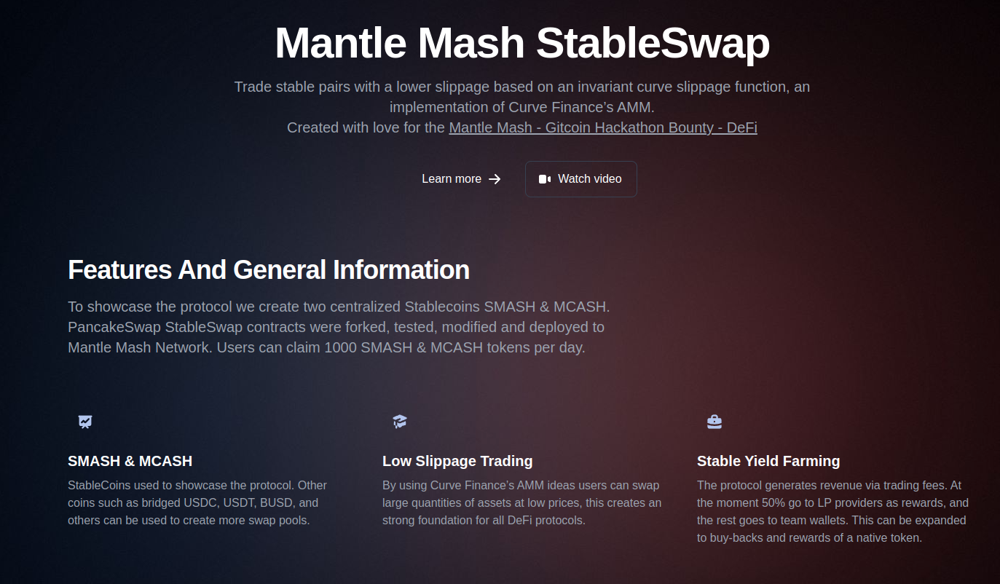
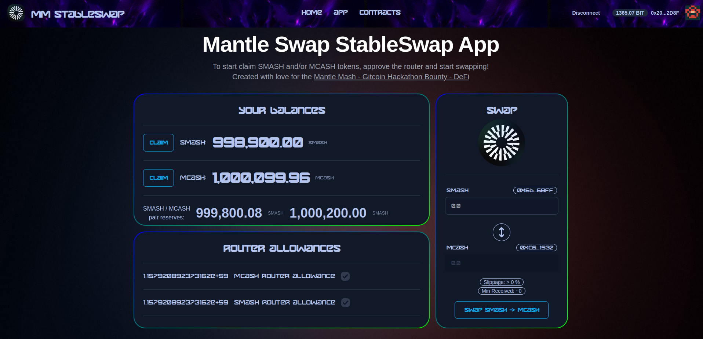
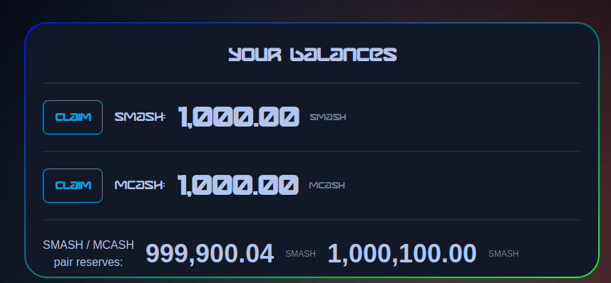
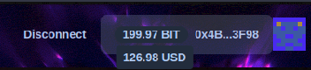
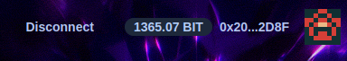
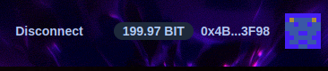
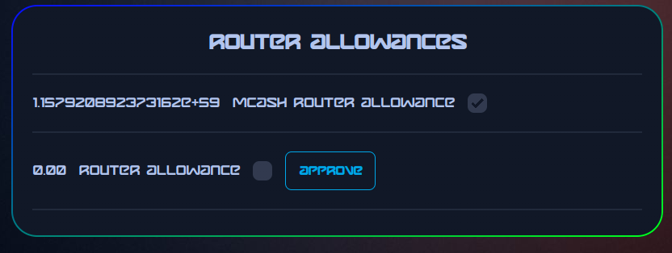
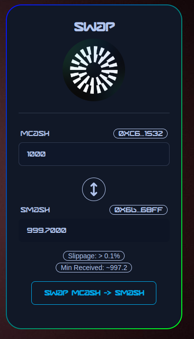
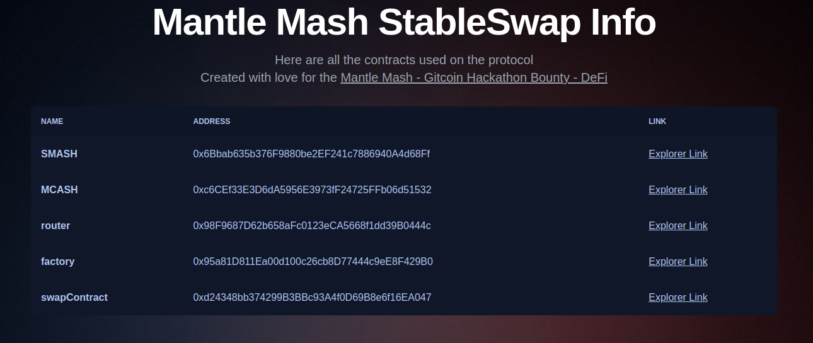

# Mantle Mash StableSwap

Mantle Mash StableSwap is a trade platform that allows stable pairs to be traded with a lower slippage based on an invariant curve slippage function, an implementation of Curve Finance’s Automated Market Maker (AMM). The platform was created with love for the Mantle Mash - Gitcoin Hackathon Bounty - DeFi, and was designed to provide a user-friendly and seamless experience for DeFi-related interactions.

## Features and General Information

### SMASH & MCASH
To showcase the platform, two centralized Stablecoins, SMASH & MCASH, were created. PancakeSwap StableSwap contracts were forked, tested, modified, and deployed to Mantle Mash Network. Users can claim 1000 SMASH & MCASH tokens per day.

### Low Slippage Trading
By using Curve Finance’s AMM ideas, users can swap large quantities of assets at low prices, providing a strong foundation for all DeFi protocols.

### Stable Yield Farming
The platform generates revenue via trading fees. At the moment, 50% of the fees go to LP providers as rewards, and the rest goes to team wallets. This can be expanded to buy-backs and rewards of a native token.

## Judging Criteria Checklist
The judging criteria for the Best DeFi Project are as follows:

Originality and innovation in the implementation of DeFi on Mantle:
+ This project is the first of its kind on the network, and could expand to be the top protocol for stablecoins trading.

User experience and ease of use for DeFi-related interactions:
+ Display User BIT Balance
+ Display Relative USD value of BIT
+ Hot-swapping accounts accepted
+ Blockies for user addresses implemented
+ Clear SMASH and MCASH user balances display
+ Clear pair reserves display
+ Easy and intuitive drip of SMASH and MCASH tokens
+ Swap Router allowances diplayed 
+ Polished website with information
+ Seamless swap, and change of coins
+ Info page with contracts and links to them

Relevance and impact on the overall DeFi ecosystem
+ Trade stable pairs with a lower slippage based on an invariant curve slippage function, an implementation of Curve Finance’s AMM
+ One of the most important protocols needed in a blockchain
+ More pairs can be added in the future
+ A cross chain stablecoin bridge is also possible
+ Creation of native token and yield also possible

Technical feasibility and implementation quality
+ To my knowledge there are no forks of StableSwap at the moment
+ Contracts, Test, Deployments scripts can be found in the Foundry folder

## UX/UI

